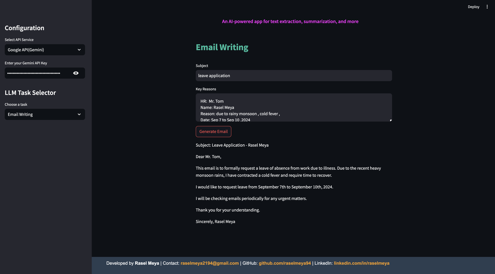
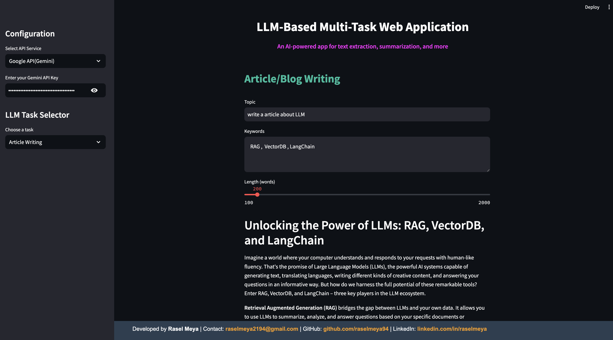
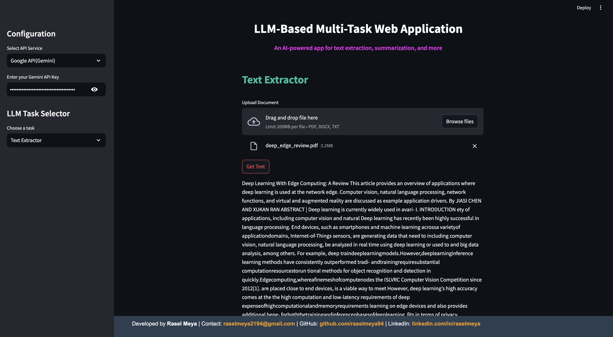
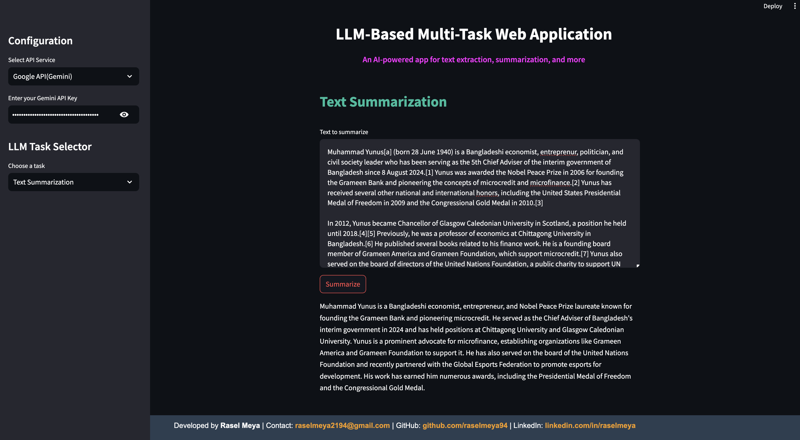
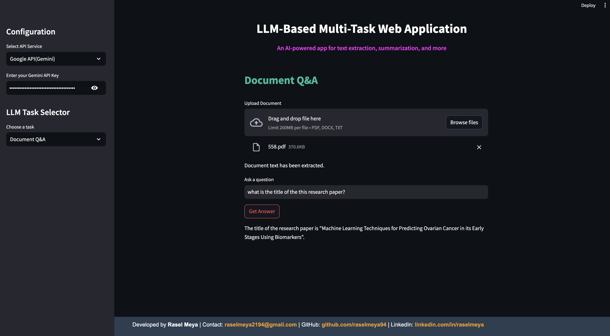
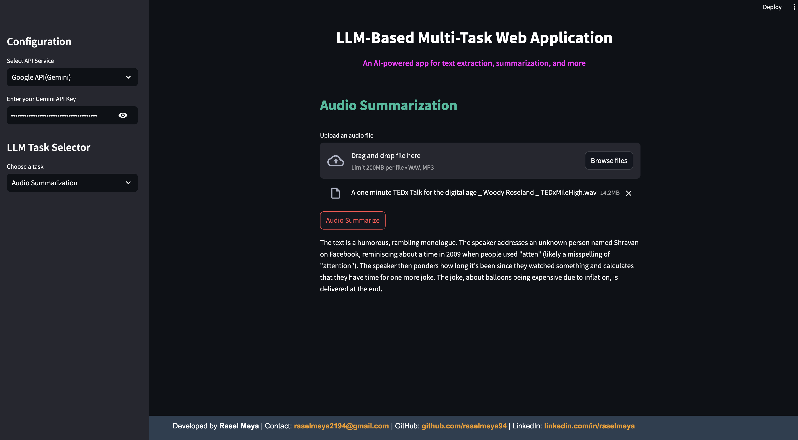

# Multi-Task LLM Applications

## Overview

This project aims to develop a multi-task application leveraging the power of Large Language Models (LLMs). The application will provide a variety of functionalities, allowing users to perform diverse tasks such as generating emails, summaries, audio and video summaries, answering questions, generating articles or blogs, and converting documents to text. The versatility of LLMs will enable users to streamline their workflow by using a single platform for multiple tasks.

## Features

### 1. **Email Writing**
   - **Description**: Automatically create a professional email based on a given subject and key points.
   - **Usage**: Users input the subject and key reasons, and the application generates a well-structured email.
   - **Examples**:
   

### 2. **Article/Blog Writing**
   - **Description**: Compose articles or blog posts on specified topics with minimal input.
   - **Usage**:
     1. **Specify a Topic**: Users begin by entering the main topic or title for the article or blog post.
     2. **Provide Key Points**: Users then list key points or subtopics they want to be covered in the content.
     3. **Choose Length**: Users can specify the desired length of the article or blog post (e.g., short, medium, long).
     4. **Generate Content**: The application uses the provided inputs to draft a comprehensive article or blog post.
   - **Examples**: 

### 3. **Text Extractor**
   - **Description**: Extracts text from multiple file formats, including PDFs, DOCs, and plain text files.
   - **Usage**: Facilitates the extraction of readable text content from diverse document types, enabling further processing or analysis.
   - **Examples**:

### 4. **Text Summarization**
   - **Description**: Summarize lengthy documents text or articles into concise summaries.
   - **Usage**: Users provide the text  and the application returns a summary capturing the essential points.
   - **Examples**: 
   
### 5. **Question Answering with Document**
   - **Description**: Provide answers to questions based on the context of a provided document or text.
   - **Usage**:
     1. **Upload Document**: Users first upload a document (PDF, Word and Text) containing the relevant information.
     2. **Ask a Question**: After uploading, users can input questions related to the content of the document.
     3. **Receive Answers**: The application analyzes the document and provides accurate answers based on the context of the uploaded content.
   - **Examples**: 

### 6. **AudioFile Summarization**
   - **Description**: Convert text summaries into audio files for easy listening.
   - **Usage**: Users can generate an audio version of a summary, making it convenient to consume content on the go.
   - **Examples**:
   


## Implementation

The project will be implemented using the following technologies:

- **Language Model**: The core processing will be powered by the **gemini-1.5-flash and gpt-3.5-turbo** model, which provides access to advanced Large Language Models (LLMs) for various tasks such as text generation, summarization, question answering, and more.
  
- **Frameworks**:
  - **Python**: The primary programming language for backend logic and integration with the Gemini API.
  - **Streamlit**: Used for creating the user interface, allowing for an interactive and responsive frontend experience.
  

## Installation and Setup

1. **Clone the Repository**
   ```bash
   git clone https://github.com/raselmeya94/Multi-Task-LLM-Based-Web-Application.git
   cd Multi-Task-LLM-Based-Web-Application

2. **Install Dependencies**

    ```bash
    pip install -r requirements.txt
    ```

3. **Run the Application**

   ```bash
    streamlit run app.py
    ```
4. **Select Configuration and put your API Key**
   - OpenAI API key
   - Google API key(Gemini)
5. **Select Task**
   - Text Extraction task
   - Email Writing
   - Article Writing
   - Text Summarization
   - Document Q&A
   - Audio Summarization


## Usage
- Navigate to the application URL provided after running the app.
- Select the desired task from the menu.
- Provide the required input in the designated fields.
- Click the corresponding button to generate results (email, summary, etc.).


## Contribution

We welcome contributions to enhance this project. If you'd like to contribute, please follow these steps:

1. Fork the repository and clone it to your local machine.
2. Create a new branch for your feature or fix.
3. Make your changes and commit them with clear messages.
4. Push your changes to your forked repository.
5. Open a pull request with a detailed description of your changes.

## License

This project is licensed under the MIT License. See the [LICENSE](LICENSE) file for more details.

## Contact

- **Developed by**: Rasel Meya
- **Email**: [raselmeya2194@gmail.com](mailto:raselmeya2194@gmail.com)
- **GitHub**: [github.com/raselmeya94](https://github.com/raselmeya94)
- **LinkedIn**: [linkedin.com/in/raselmeya](https://linkedin.com/in/raselmeya)
